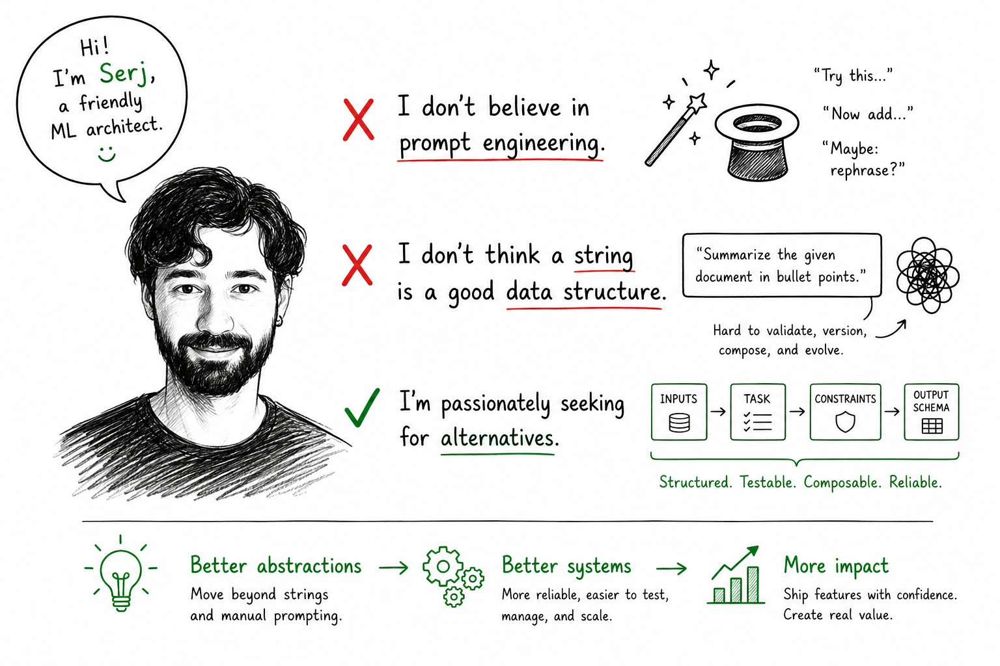

# Skills

Local Codex-compatible skills.

This repository collects reusable skills that were developed during real project work and then extracted into a cleaner standalone form.

## About

Created by Serj Smorodinsky.

- Newsletter: https://mlarchitect.substack.com/
- Source project: https://github.com/SerjSmor/agentic_atis



## Skills

### `dspy`

A skill for agentic DSPy experimentation.

It helps with:
- choosing a reasonable optimizer for the problem
- starting with a cheap baseline such as `LabeledFewShot`
- deciding when to use teacher or reflection models
- structuring a local DSPy experiment surface
- naming iterations consistently
- tracking compilation and evaluation tokens, cost, and runtime separately
- keeping `results.tsv` and Weights & Biases logging disciplined

This skill was born out of the ATIS comparison work in:
- https://github.com/SerjSmor/agentic_atis

That project compared prompt-only agentic iteration, plain DSPy optimization, and agentic-on-DSPy workflows. The `dspy` skill captures the parts of that process that were reusable beyond that one repository.

### `active-learning`

A skill for running active learning loops on low-label predictive tasks.

It helps with:
- interviewing the user about data access and label availability
- setting up a small seed set when labeled data is sparse
- choosing a batch selection heuristic such as uncertainty sampling
- using `Argilla` as the default annotation surface
- incorporating strong LLMs as judges for weak evaluation or triage when appropriate
- tracking iterations, annotation rounds, and evaluation cleanly

This skill was created to capture the minimum durable decisions needed for active learning workflows: data access, annotation strategy, batch selection, evaluation, and stopping criteria.

### `continuous-quality-audit`

A skill for continuously auditing model outputs to verify that they remain normal, stable, and reviewable over time.

It helps with:
- interviewing the user about the model, output surface, and audit source
- defining or constructing a baseline or reference distribution
- running distribution, rule-based, sample-based, and drift-focused audits
- using strong LLMs as judges for weak evaluation or triage when appropriate
- saving flagged outputs to `Argilla` or a DB-backed destination
- tracking sampling policy, drift signals, and anomaly counts cleanly

This skill was created to capture the minimum durable decisions needed for recurring quality audits: what normal means, how to detect drift, how to sample outputs, how to review them, and where to save the results.

## Structure

Each skill lives in its own folder and is self-contained:

- `SKILL.md`: primary instructions
- `agents/openai.yaml`: display metadata and default prompt hook
- `references/`: optional supporting notes
- `scripts/`: optional helper scripts

## Install / use

You can use this repo in two common ways.

1. Copy a skill folder into a project-local `skills/` directory.
2. Copy a skill folder into your Codex skills home so it is available across sessions.

Example:

```bash
cp -R dspy /path/to/project/skills/
cp -R active-learning /path/to/project/skills/
cp -R continuous-quality-audit /path/to/project/skills/
```

Or:

```bash
cp -R dspy ~/.codex/skills/
cp -R active-learning ~/.codex/skills/
cp -R continuous-quality-audit ~/.codex/skills/
```

## Repository layout

```text
README.md
assets/
  serj-beliefs.png
active-learning/
  SKILL.md
  agents/
    openai.yaml
continuous-quality-audit/
  SKILL.md
  agents/
    openai.yaml
dspy/
  SKILL.md
  agents/
    openai.yaml
  references/
    optimizer-choice.md
    compile-accounting.md
```

## Notes

- Keep each skill narrowly scoped.
- Prefer reusable references over project-specific assumptions.
- Put durable workflow guidance in `SKILL.md` and keep repo-specific conventions out unless the skill is intentionally project-bound.
